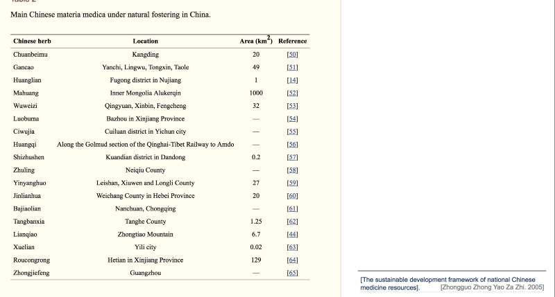

  

[https://www.ncbi.nlm.nih.gov/pmc/articles/PMC4449915/](https://www.ncbi.nlm.nih.gov/pmc/articles/PMC4449915/)

Yin and Yang principles

_Cordyceps sinensis <=>champignon chenille_

_Dendrobium officinale&é_

_Fritillaria cirrhosa_

_ Saussurea involucrata_

  

herboriste francaise:

[**Herboristerie, Aromathérapie, Phytothérapie, Huiles essentielles - France Herboristerie**  
_France herboristerie vous propose une gamme de soins naturels pour toute la famille. Pour se soigner et pour l'hygiène…_www.france-herboristerie.com](https://www.france-herboristerie.com/ "https://www.france-herboristerie.com/")

[**Accueil - À la Calebasse Verte**  
_Contenu en pleine largeur Le laboratoire Calebasse Verte distribue des produits de médecine traditionnelle chinoise…_www.calebasse.fr](https://www.calebasse.fr/ "https://www.calebasse.fr/")
